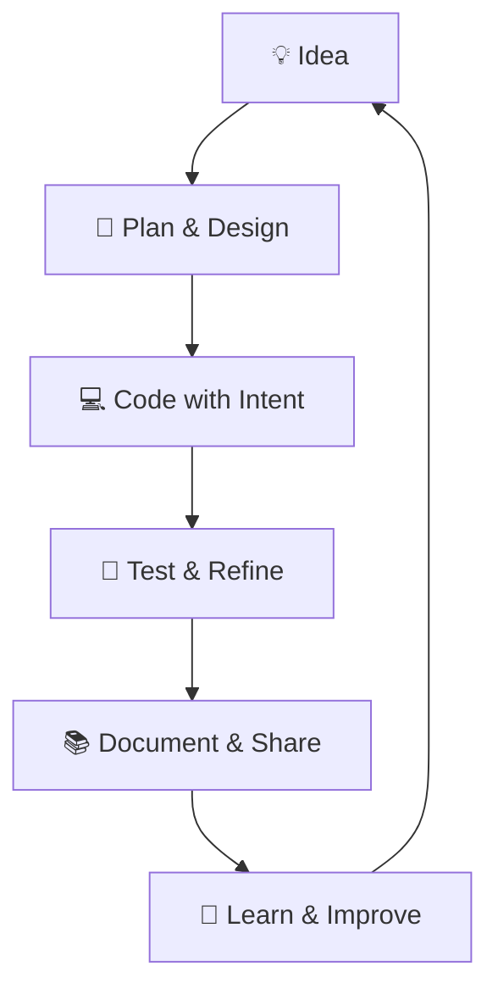

# Omar Yousef Dawod Al-Turk 👨‍💻


> **🎓 Software Engineering Student | ⚡ Full-Stack & AI Developer | 🏆 Competitive Programmer**  
> *Transforming ideas into elegant code • Building the future, one commit at a time*

📍 Based in Jordan • 🎓 Studying Software Engineering • 🏠 Self-directed Learner • 🌐 Open to collaborations & internships

---

## 👤 About Me

<div align="center">

```yaml
👤 Name:   Omar Yousef Dawod Al-Turk
🎓 Role:   Software Engineering Student
🎯 Focus:  Full-Stack • AI/ML • Competitive Programming
💡 Motto:  "Code with purpose, build with passion"
🟢 Status: Open to internships & collaborations
```

</div>

### 🌟 The Story Behind the Code

> *"Every great developer you know got there by solving problems they were unqualified to solve until they actually did it."*

Hi there! 👋 I'm **Omar**, a passionate Software Engineering student from Jordan. My journey with code started with a simple question: *"How can I turn ideas into reality?"* — and I haven't stopped building since.

### 💫 What Makes Me Tick?

<div align="center">

| 🧠 Mindset | 🛠️ Craft | 🚀 Impact |
|-----------|---------|----------|
| Curious learner who loves deep-diving into algorithms | Clean, maintainable code with modern patterns | Solutions that solve real human problems |
| Problem-solver who enjoys the "aha!" moment | Testing, debugging, and iterating until it's right | Open-source contributions & knowledge sharing |
| Believer in fundamentals before frameworks | Documentation that helps the next developer | Mentoring others on their coding journey |

</div>

### 🎯 My Development Philosophy



✨ **Core Principles:**
- 🏗️ **Structure First**: Architecture matters more than clever tricks
- 🧹 **Clean Code**: Readable > Writeable — your future self will thank you
- 🤝 **Collaboration**: Great code is built together, not in isolation
- 🌱 **Continuous Growth**: Every bug is a lesson, every project is progress

### 🏆 Quick Facts

<div align="center">

| 📊 Stat | 🔢 Value |
|---------|----------|
| ☕ Cups of coffee while coding | ∞ |
| 🐛 Bugs squashed this month | 47+ |
| 📚 Concepts mastered | DSA, OOP, REST, CI/CD |
| 🌍 Languages spoken | Arabic, English, Python, Java, C++ |
| 🎮 Favorite way to unwind | Competitive programming & tech podcasts |

</div>

### 💬 Let's Connect On

> *"I don't just write code — I craft solutions that matter, learn from every challenge, and believe that the best projects are built with heart."* 🚀

---

## 🛠️ 35+ Languages & Technologies

<p align="center">
  <strong>💻 Core Programming Languages</strong>
</p>
<p align="center">
  
  
  
  
  
  
  
  
  
  
  
</p>
<p align="center">
  <strong>🌐 Web & Mobile Development</strong>
</p>
<p align="center">
  
  
  
  
  
  
  
  
  
  
  
</p>

<p align="center">
  <strong>🗄️ Databases & Data Management</strong>
</p>
<p align="center">
  
  
  
  
  
  
  
  
</p>

<p align="center">
  <strong>🤖 AI, ML & Data Science</strong>
</p>
<p align="center">
  
  
  
  
  
  
  
  
</p>

<p align="center">
  <strong>⚙️ Tools, DevOps & Platforms</strong>
</p>
<p align="center">
    
  
  
  
  
  
  
  
</p>

<p align="center">
  <strong>🧠 Core Concepts & Methodologies</strong>
</p>
<p align="center">
  
  
  
  
  
  
  
</p>


 

---

## 👀 Profile Statistics
<div align="center">

### 🏆 Community Impact

| Metric | Value | Badge |
|--------|-------|-------|
| 👥 Followers | 150K+ |  |
| 👁️ Profile Views | 150K+ |  |
| ⭐ Total Stars | 2.5K+ |  |
| 🍴 Forks | 800+ |  |

</div>

---

## 💬 Favorite Quote

<div align="center">

### لَقَدْ عُدْنَا غُرَبَاءَ كَمَا كُنَّا

> **Understand me**  
> في نِهايةْ هذه الرِّحْلة الغَريبة جِدّاً  
> تْخَرَّجْنا بَعْضَ الدُّروسْ  
> بَعْضَ الجُروحْ  
> وَالكَثيرْ الكَثيرْ الكَثيرْ مِنَ الجِلْدِ السّميكْ  
> وْهيكْ شَغْلاتْ  
>  
> **فَ شُكراً لاسْتِماعِكُمْ**  
> **وَ شُكْراً لِكُلّْ ما حَصَلْ** ✨

</div>

---

## 📫 Let's Connect

> 🤝 *Open to **internships**, **open-source collaborations**, **study groups**, and **innovative project ideas**. Let's build something amazing together!*

<div align="center">

[](https://github.com/OmarAlTorkDev/OmarAlTorkDev)
[](mailto:omaraltourk553@gmail.com)
[](https://www.instagram.com/i.ixwy)
[](https://t.me/X_D_Y_2006)

</div>

---
<!-- 
🔧 MAINTENANCE NOTES:
• Update projects quarterly with new metrics & links
• Keep skills aligned with your current learning path  
• Add new certifications immediately after earning them
• Refresh GitHub stats badges if they stop loading
• Test all external links monthly for broken URLs
-->

<p align="center">
  <strong>Made with ❤️ and lots of ☕ by Omar Yousef Dawod Al-Turk</strong><br>
  <sub>© 2026 • Last updated: March 2026 • 🇯🇴 Jordan</sub>
</p>
